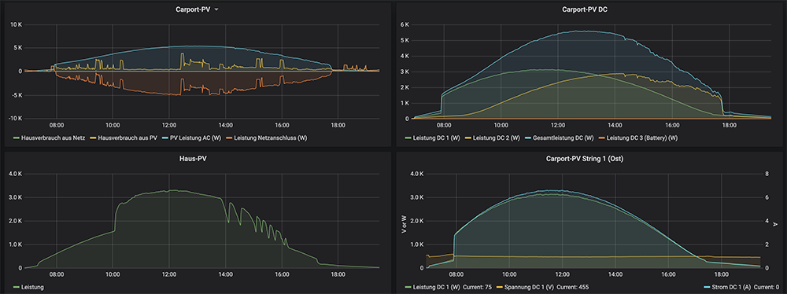

# home-monitoring
Monitor and visualize energy and resource consumption using influx, telegraf and grafana on a raspberry pi.

# Overview
The TIG-stack consisting of Telegraf, InfluxDB and Grafana provides the basis for this home monitoring solution.
They are running together on a raspberry pi 4.
Ubuntu is used as operating system.

Telegraf is used to gather the measurements from the following sources
* FritzBox via TR-094 / Universal PnP
* Kostal power inverter type Piko 3.6 (installed 2008)
* Kostal Plenticore 8.5 power inverter (installed 2020)

# Manual Setup
The following values need adjustment when setting up another instance:
* `raspi4ubuntu`: hostname of the raspi ubuntu server 
* `telegrafpassword`: the password for the telegraf user within the influx DB

## ubuntu on raspi
1. [download ubuntu image and write it on sd card](https://ubuntu.com/download/raspberry-pi/thank-you?version=18.04.4&architecture=arm64+raspi3)
1. connect raspi to lan and power, no keyboard / mouse / monitor is required 
1. use router / dhcp server to determine IP adress and define a local hostname (in this case: raspi4ubuntu)
1. ssh into ubuntu as user `ubuntu` with password `ubuntu` - changing the initial passworde is automatically requested right after login.
1. (optional) add public key as authorized ssh key
    ``` bash
    # from within your workstation terminal
    ssh-copy-id -i ~/.ssh/id_rsa.pub ubuntu@raspi4ubuntu
    ```
1. [basic system config](https://jamesachambers.com/raspberry-pi-ubuntu-server-18-04-2-installation-guide/) 
    ``` bash
    # within ubuntu shell
    sudo apt-mark hold flash-kernel
    sudo apt-get update && sudo apt-get upgrade
    sudo dpkg-reconfigure tzdata
    sudo hostnamectl set-hostname raspi4ubuntu
    ```

## install TIG-Stack (Telgraf, InfluxDB, Grafana) Stack
see also: [complete  tutorial](https://www.howtoforge.com/tutorial/how-to-install-tig-stack-telegraf-influxdb-and-grafana-on-ubuntu-1804/)
1. InfluxDB
    ``` bash
    sudo curl -sL https://repos.influxdata.com/influxdb.key | sudo apt-key add -
    source /etc/lsb-release
    echo "deb https://repos.influxdata.com/${DISTRIB_ID,,} ${DISTRIB_CODENAME} stable" | sudo tee /etc/apt/sources.list.d/influxdb.list
    sudo apt update
    sudo apt install influxdb -y
    sudo systemctl start influxdb
    sudo systemctl enable influxdb
    # check that ports 8088 and 8086 are in LISTEN state
    netstat -plntu
    ```
    Create Database and User using the `influx` shell
    ```bash
    ubuntu@ubuntu:~$ influx
    Connected to http://localhost:8086 version 1.7.10
    InfluxDB shell version: 1.7.10
    > create database telegraf
    > create user telegraf with password 'telegrafpassword'
    > exit
    ubuntu@ubuntu:~$ 
    ```

1. Telegraf Agent
    ``` bash
    sudo apt install telegraf -y
    sudo systemctl start telegraf
    sudo systemctl enable telegraf
    sudo systemctl status telegraf
    ```
    
    Create /etc/telegraf/telegraf.conf
    ``` bash
    cd /etc/telegraf/
    sudo mv telegraf.conf telegraf.conf.default
    ```
    Provide new config (eg using `sudo vi telegraf.conf`):
    ``` 
    # Global Agent Configuration
    [agent]
      hostname = "raspi4ubuntu"
      flush_interval = "15s"
      interval = "15s"
    
    
    # Input Plugins
    [[inputs.cpu]]
        percpu = true
        totalcpu = true
        collect_cpu_time = false
        report_active = false
    [[inputs.disk]]
        ignore_fs = ["tmpfs", "devtmpfs", "devfs"]
    [[inputs.io]]
    [[inputs.mem]]
    [[inputs.net]]
    [[inputs.system]]
    [[inputs.swap]]
    [[inputs.netstat]]
    [[inputs.processes]]
    [[inputs.kernel]]
    
    # Output Plugin InfluxDB
    [[outputs.influxdb]]
      database = "telegraf"
      urls = [ "http://127.0.0.1:8086" ]
      username = "telegraf"
      password = "telegrafpassword"
    ```
    restart telegraf agent
    ``` bash
    sudo systemctl restart telegraf
    ```
3. Grafana    
    [official install documentation](https://grafana.com/docs/grafana/latest/installation/debian/) recommends to use the enterprise edition 
    ``` bash
    sudo apt-get install -y apt-transport-https
    sudo apt-get install -y software-properties-common wget
    wget -q -O - https://packages.grafana.com/gpg.key | sudo apt-key add -
    sudo add-apt-repository "deb https://packages.grafana.com/enterprise/deb stable main"
    
    sudo apt-get install grafana-enterprise
    
    sudo systemctl start grafana-server
    sudo systemctl enable grafana-server
    netstat -plntu
    # check that grafana listens on port 3000
    ```
    Finish Grafana setup in the GUI:
    * open grafana in your browser (http at port 3000 served by raspi)
    * login to grafana using default credentials admin/admin
    * change default password
    * add InfluxDB datasource on http://localhost:8086/ using telegraf db and telegraf user credentials
    * import grafana dashboard e.g. system metrics "https://grafana.com/dashboards/5955"

TIG stack is now ready.
But the only measurements are the system metrics of the raspi host system itself.

## Gather metrics from Kostal Plenticore power inverter via modbus
Current power inverter from kostal have a modbus TCP interface.
The [modbus interface definition](https://www.kostal-solar-electric.com/de-de/download/-/media/document%20library%20folder%20-%20kse/2018/08/30/08/53/ba_kostal_interface_modbus-tcp_sunspec.pdf)
describes the available registers in chapter "3. MODBUS Register table".

The modbus interface has to be enabled within the inverter webgui and the port to be used may be changed there.

There is also a [modbus input plugin](https://github.com/influxdata/telegraf/tree/master/plugins/inputs/modbus) 
available for telegraf.

The tricky part is to use the correct byte ordering and datatype, which is not specified in the kostal interface documentation.
All registers with type `Float` in the register table need to be defined with `data_type=FLOAT32-IEEE` and `byte_order="CDAB"`. 
I found this detail in [netzkind's github project](https://github.com/netzkind/telegraf-kostal-modbus).
 
Furthermore, two consecutive register addresses need to be given.

Place file [modbus-kostal.conf](modbus-kostal/modbus-kostal.conf) into `/etc/telegraf/telegraf.d/`. 
The `controller = "tcp://192.168.178.65:1502"` parameter needs to be adjusted to the inverter's actual ip adress and the configured modbus tcp port.